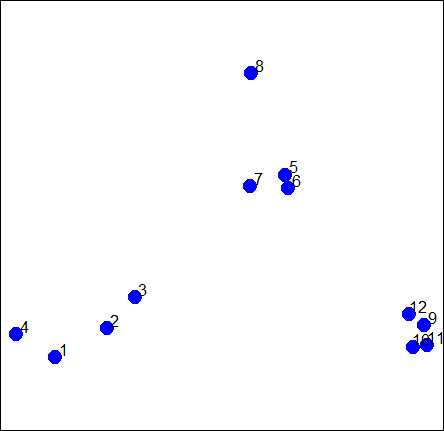
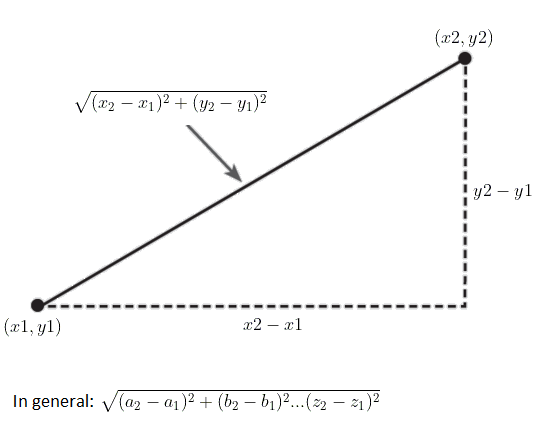
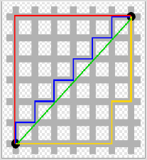
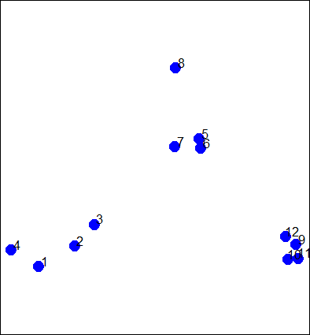
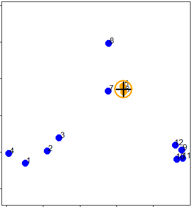
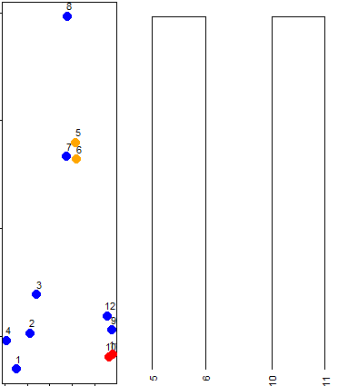
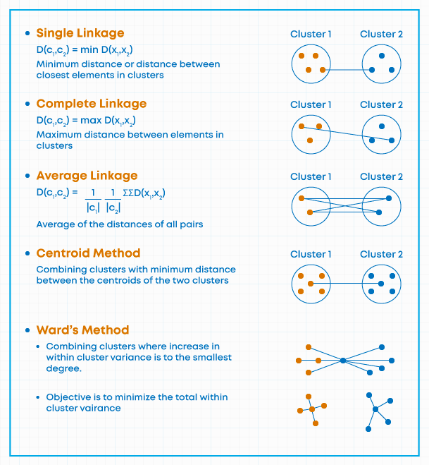
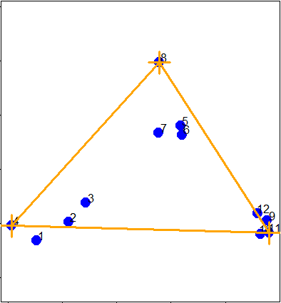
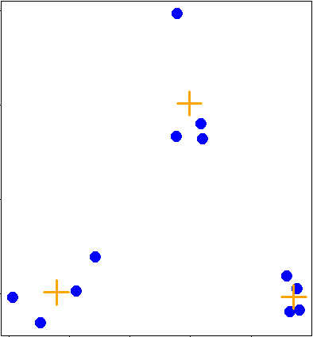
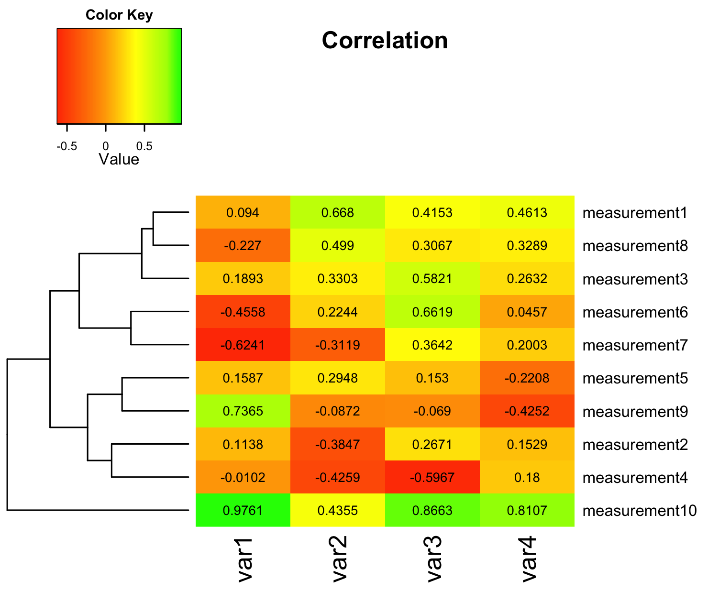

```{r setup, include=FALSE}
knitr::opts_chunk$set(echo = TRUE)
```

### 1 Introduction

- **Hierarchical clustering** is an **agglomerative**, or **bottom-up**, approach.
- It is a simple way of quickly examining and displaying multi-dimensional data.
- This technique is usually most useful in the early stages of analysis when we're trying to get an understanding of the data,
    - e.g., finding some pattern or relationship between different factors or variables.
- As the name suggests hierarchical clustering creates a hierarchy of clusters.

#### 1.1 Cluster Analysis

- Clustering organizes data points that are close into groups.
- So obvious questions are
    - "How do we define close?",
    - "How do we group things?", and
    - "How do we interpret the grouping?"
- Cluster analysis is a very important topic in data analysis.

- Example: consider these random points we generated. We'll use them to demonstrate hierarchical clustering



#### 1.2 Hierarchical clustering Process

1. Each observation starts in its own cluster, and pairs of clusters are merged as one moves up the hierarchy.
  i. This means that we'll find the closest two points and put them together in one cluster, 
  ii. then find the next closest pair in the updated picture, and 
  iii. so forth.
2. We'll repeat this process until we reach a reasonable stopping place.

- Note the word "**reasonable**". There's a lot of flexibility in how we perform our analysis depends on your problem.
- According to Wikipedia, "one can decide to stop clustering either when the clusters are too far apart to be merged (distance criterion) or when there is a sufficiently small number of clusters (number criterion)."

<hr>

Q.1: In the given plot which pair points would you first cluster? Use distance as the metric.

- 1: 5 and 6
- 2: 1 and 4
- 3: 10 and 12
- 4: 7 and 8

Answer: It's pretty obvious that out of the 4 choices, the pair 5 and 6 were the closest together. However, there are several ways to measure distance or similarity.

#### 1.3 Ways to measure distance or similarity

- There are several ways to measure distance or similarity.
  
  1. Continuous Measures
      - Euclidean distance and
      - Correlation similarity 
    
  2. Binary Measure
      - Manhattan distance

- It's important that you use a measure of distance that fits your problem.

### 2. Euclidean distance

- Given two points on a plane, $(x1,y1)$ and $(x2,y2)$, the Euclidean distance is the square root of the sums of the squares of the distances between the two x-coordinates $(x1-x2)$ and the two y-coordinates $(y1-y2)$.




Euclidean distance is distance "as the crow flies".
Many applications, however, can't realistically use crow-flying distance. Cars, for instance, have to follow roads.

### 3. Manhattan distance

- Manhattan distance or city block distance (also known as a taxicab metric).



- You want to travel from the point at the lower left to the one on the top right.
- The shortest distance is the Euclidean (the green line), but you're limited to the grid, so **you have to follow a path similar to those shown in red, blue, or yellow**.
- These **all have the same length (12)** which is the number of small gray segments covered by their paths.

<hr>

- More formally, Manhattan distance is the sum of the absolute values of the distances between each coordinate,
- so the distance between the points $(x1,y1)$ and $(x2,y2)$ is $|x1-x2|+|y1-y2|$.
- As with Euclidean distance, this too generalizes to more than 2 dimensions.


### 4. Demonstrat an agglomerative (bottom-up) technique of hierarchical clustering and create a dendrogram



We'll use this `df` to demonstrate an agglomerative (bottom-up) technique of hierarchical clustering and create a dendrogram.<br>
This is an abstract picture (or graph) which shows how the 12 points in our dataset cluster together.<br>
Two clusters (initially, these are points) that are close are connected with a line, We'll use Euclidean distance as our metric of closeness.

```{r}
# Dataset
df = read.csv("./data/Hcluster_df.csv")
```


#### 4.1. 'dist' command:

- `dist` with the argument `df` to compute the distances between all pairs of these points.
- By default `dist` uses **Euclidean distance** as its metric, but other metrics such as Manhattan, are available.

```{r}
# Distance Matrix
dist(df)
```

##### Explanation:

- You see that the output is a lower triangular matrix with rows numbered from 2 to 12 and columns numbered from 1 to 11.
- Entry $(i,j)$ indicates the distance between points $i$ and $j$.
- Clearly we need only a lower triangular matrix since the distance between points $i$ and $j$ equals that between $j$ and $i$.

<hr>

Question: From the output of dist, what is the minimum distance between two points?

1. 0.08317
2. 0.0815
3. -0.0700
4. 0.1085

Answer: 2




- So $0.0815$ (units are unspecified) between points 5 and 6 is the shortest distance.
- We can put these points in a single cluster and look for another close pair of points.

<hr>

Question: Looking at the picture, what would be another good pair of points to put in another cluster given that 5 and 6 are already clustered?

1. 10 and 11
2. 1 and 4
3. 7 and 8
4. 7 and the cluster containing 5 ad 6

Answer: 1
<br>

- So 10 and 11 are another pair of points that would be in a second cluster.
We'll start creating our dendrogram now.
- Here're the original plot and two beginning pieces of the dendrogram.



<hr>

#### 4.2. hclust() command
- We can keep going like this in the obvious way and pair up individual points, but 
- R provides a simple function which creates a dendrogram.
  - It's called `hclust()` and takes as an argument the `pairwise distance matrix`. 

```{r}
# Distance Matrix
distxy <- dist(df)

# Dendrogram 
hc <- hclust(distxy)
plot(hc)

```

##### Explanation: 
- R's plot conveniently labeled everything for us.
- The points we saw are the leaves at the bottom of the graph, 5 and 6 are connected, as are 10 and 11.
- Moreover, we see that the original 3 groupings of points are closest together as leaves on the picture.
- That's reassuring. 

```{r}

# Dendrogram (all values at same level)

plot(as.dendrogram(hc))

```

##### Explanation: 
- The essentials are the same, but the labels are missing and the leaves (original points) are all printed at the same level.
- Notice that the vertical heights of the lines and labeling of the scale on the left edge give some indication of distance.

#### 4.3. abline() command

##### horizontal blue line at 1.5 on this plot. 

```{r}

# Dendrogram
plot(as.dendrogram(hc))

# abline
abline(h =1.5, col ="blue")

```

##### Explanation:

- We see that this blue line intersects 3 vertical lines and this tells us that using the distance 1.5 (unspecified units) gives us 3 clusters (1 through 4), (9 through 12), and (5 through 8).
- We call this a "cut" of our dendrogram. 

```{r}
# Dendrogram
plot(as.dendrogram(hc))

# abline
abline(h =1.5, col ="blue")

abline(h =0.4, col ="red")
```

##### Explanation:

- We see that by cutting at .4 we have 5 clusters, indicating that this distance is small enough to break up our original grouping of points.
<hr>

```{r}
# Dendrogram
plot(as.dendrogram(hc))

# abline
abline(h =1.5, col ="blue")

abline(h =0.4, col ="red")

abline(h =0.08, col ="green")
```

##### Explanation:
- If we drew a horizontal line at .05,
    - our shortest distance was around .08, so a distance smaller than that would make all the points their own private clusters.

<hr>

Notice that the two original groupings, 5 through 8, and 9 through 12, are connected with a horizontal line near the top of the display.
<br>
You're probably wondering how distances between clusters of points are measured.

#### 4.4. Agglomerative clustering linkage algorithm (Cluster Distance Measure)



<hr>

#### 4.5. Complete Linkage

The complete linkage says that if you're trying to measure a distance between two clusters, take the greatest distance between the pairs of points in those two clusters.
  - Obviously such pairs contain one point from each cluster.

1. If we were measuring the distance between the two clusters of points (1 through 4) and (5 through 8), using complete linkage as the metric we would use the distance between points 4 and 8 as the measure since this is the largest distance between the pairs of those groups.

2. The distance between the two clusters of points (9 through 12) and (5 through 8), using complete linkage as the metric, is the distance between points 11 and 8 since this is the largest distance between the pairs of those groups.

3. The distance between the two clusters of points (9 through 12) and (1 through 4), using complete linkage as the metric, is the distance between points 11 and 4.



```{r}
# dataframe dfsm for you containing three points, 4, 8, and 11.
dfsm <- read.csv("./data/dfsm.csv")

# Smallest distance between three points
dist(dfsm)

```

The smallest distance is between points 2 and 3 in this reduced set, (these are actually points 8 and 11 in the original set), indicating that the two clusters these points represent ((5 through 8) and (9 through 12) respectively) would be joined (at a distance of 1.869) before being connected with the third cluster (1 through 4). This is consistent with the dendrogram we plotted.

```{r}
# Dendrogram (all values at same level)
plot(as.dendrogram(hc))
```

#### 4.6. Average Linkage

- First we will compute an "average" point in each cluster (think of it as the cluster's center of gravity).
- We do this by computing the mean (average) x and y coordinates of the points in the cluster.
- Then you compute the distances between each cluster average to compute the intercluster distance.



<hr>

```{r}
# By Default Complete linkage is used 
print(hc)
```
- In our simple set of data, the average and complete linkages aren't that different,
but in more complicated datasets the type of linkage you use could affect how your data clusters.
- It is a good idea to experiment with different methods of linkage to see the varying ways your data groups.
- This will help you determine the best way to continue with your analysis.

### 5. Heat Map

- Heat Map is "a graphical representation of data where the individual values contained in a matrix are represented as colors.
- Heat maps originated in 2D displays of the values in a data matrix. 
  - **Larger values** were **represented by** small **dark gray or black squares** (pixels) and
  - **smaller values by lighter squares**."
- Examples:
  1. Weather radar and displays of ocean salinity.
  2. Molecular biology "to represent the level of expression of many genes across a number of comparable samples (e.g. cells in different states, samples from different patients) as they are obtained from DNA microarrays."

<hr>

#### 5.1. Heat Map Example:



##### Explanation: 

- It shows a sample heat map with a dendrogram on the left edge mapping the relationship between the rows.
- The legend at the top shows how colors relate to values.

#### 5.2. heatmap()

- R provides a handy function to produce heat maps. It's called heatmap.
- We've put the point data we've been using throughout this lesson in a matrix. 

##### Example 5.2.1:

- Call `heatmap` with 2 arguments.
  - The first is dataMatrix and 
  - the second is col set equal to cm.colors(25). (this is optional step)

```{r}
# dataframe to matrix
df1 <- as.matrix(df[,c(2,3)])
df1

# heatmap 
heatmap(df1, col=cm.colors(25))

```

##### Explanation 5.2.1:

- This is a very simple heat map 
  - simple because the data isn't very complex. 
- The rows and columns are grouped together as shown by colors.
- The top rows (labeled 5, 6, and 7) seem to be in the same group (same colors) while 8 is next to them but colored differently.
  - This matches the dendrogram shown on the left edge. 
  - Similarly, 9, 12, 11, and 10 are grouped together (row-wise) along with 3 and 2.
  - These are followed by 1 and 4 which are in a separate group.
- Column data is treated independently of rows but is also grouped.


##### Example 5.2.2
```{r}
# The data is in the matrix 'mt' and contains 6 factors of 11 cars.
mt <- read.table("./data/mt.csv")
mt <- as.matrix(mt)
mt
```

```{r}
# heatmap
heatmap(mt)
```

##### Explanation 5.2.2

- It shows a little better how the rows and columns are treated (clustered and colored) independently of one another.
<br>

Can see in 'mt' matrix

- how four of the columns are all relatively small numbers and only two (disp and hp) are large? 
- That explains the big difference in color columns.

##### Example 5.2.3
- To understand the grouping of the rows.

```{r}
# Plot dendrogram of rows
distmt <- dist(mt)
denmt <- as.dendrogram(hclust(distmt))
plot(denmt)
```

##### Explanation 5.2.3

- We see that this dendrogram is the one displayed at the side of the heat map. 

#### 5.3 Generalized distance formula for more than 2 dimensions

##### Syntax:
$\sqrt{(a_2 - a_1)^2 + (b_2 - b_1)^2 + . . . + (z_2 - z_1)^2}$

##### Example: 
$\sqrt{(mpg_{Dodge\; Challenger} - mpg_{AMC\;Javelin})^2 + (cyl_{Dodge\; Challenger} - cyl_{AMC\;Javelin})^2 + . . . + (wt_{Dodge\; Challenger} - wt_{AMC\;Javelin})^2}$

```{r}
# distance matrix
distmt <- dist(mt)
distmt
```